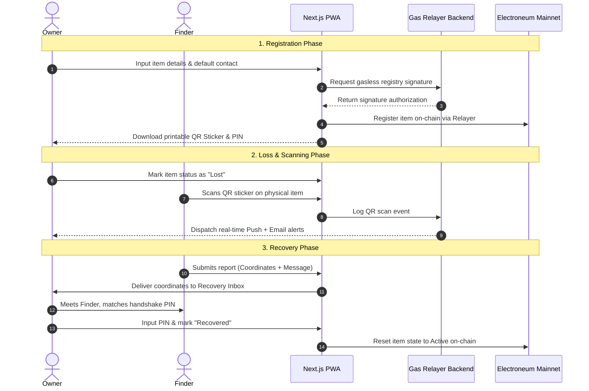

# Recover — Decentralized Physical Item Recovery Protocol

Recover is a privacy-first, secure physical item tracking and recovery protocol. By linking printed QR code stickers to an immutable decentralized ownership registry, it allows finders to contact owners instantly and coordinate returns securely—all without exposing the owner's private credentials or wallet address.

---

## 🔍 How Recover Works (The Core Flow)

### 1. Simple Tag Registration
* Owners sign in securely (using email or social credentials) without needing to handle crypto keys.
* They register their physical items (e.g., Phone, Keys, Bag) in a secure catalog.
* Category restriction: If a **Phone** is selected, the owner must provide a trusted alternate contact (Next of Kin or Close Friend) so they can be reached even if they lose their device.
* On registration, a unique printed **QR code sticker** is generated with the caption:
  > *"This item might be lost. If found, please scan to contact the owner."*

### 2. Loss & Real-time Tracking
* If an item goes missing, the owner marks it as **Lost** on their dashboard.
* When a finder scans the sticker with a phone camera, it loads the public verification landing page.
* The landing page immediately triggers a scan event in the background, dispatching **real-time Web Push alerts** and **Email notifications** directly to the owner.

### 3. Secure Handover Verification
* The finder submits a report containing their contact info, location coordinates, and a message.
* This report appears instantly in the owner's dashboard inbox.
* When meeting the finder physically, the owner enters their private verification PIN on the verification screen to match the handshake, resetting the status in the registry to **Recovered**.

---

## 📁 Repository Structure

* **`frontend/`**: Web application (Next.js + TS + thirdweb SDK v5 + Tailwind CSS v4)
* **`smart-contract/`**: Foundry workspace for contract development and deployment

---

## 🛠 Tech Stack & Architecture

### Frontend (Next.js PWA)
* Built using **Next.js** and styled with **Tailwind CSS**.
* **Progressive Web App (PWA)** compliance with an active service worker (`sw.js`) to support standalone home-screen installation on iOS and Android.
* **TanStack Query** handles real-time UI status polling and alerts synchronization.
* Direct RPC reads on the client-side are prohibited; all frontend pages query local database APIs.

### Backend (Next.js API Routes & Prisma)
* Database layer: **PostgreSQL** (hosted via Supabase) mapped with **Prisma ORM**.
* Uses **Connection Pooling** (Transaction mode for serverless functions, Session mode for DDL schema pushes).
* **Resend API Integration**: Sends real-time responsive HTML email alerts to owners when codes are scanned or reports are submitted.
* **Web Push Protocol**: Signs and broadcasts native mobile push alerts to clients.

### Smart Contract Layer (Electroneum Mainnet)
* Developed using **Foundry** (`forge`, `cast`) and deployed directly to Electroneum Mainnet.
* **Universal Upgradeable Proxy Standard (UUPS)**: Inherits from OpenZeppelin's UUPS Upgradeable contracts to allow future feature expansions.
* **Gasless Relayer Pattern**: Uses a cryptographic signer witness on the backend. When users register or transition item statuses, the relayer submits write transactions to the blockchain on their behalf, sponsoring gas fees to provide a seamless Web2-like user experience.

#### Deployed Contracts:
- **Electroneum Mainnet (`52014`)**:
  - **Proxy Address:** `0x67648938d99bd1809987F18a09f427D8da6C88fd`
  - **Implementation v2 (Item Deletion):** `0x86eeD26665114ECCdD2DbbCE880f968D3A908fb2` (Verified)
- **Electroneum Testnet (`5201420`)**:
  - **Proxy Address:** `0xb7D165292dA19BE617d7E0C6b983CFA2b3716BFE`
  - **Implementation v2 (Item Deletion):** `0x0a637c959cAc325b8a422d4E17EE0f1b7F57Af3b`

---

## 🚀 Workspace Commands

Run these commands from the root directory:

* **`npm run dev`**: Start the frontend development server
* **`npm run build`**: Build the frontend for production
* **`npm run start`**: Start the production server for the frontend
* **`npm run compile`**: Compile smart contracts (Forge build)
* **`npm run test`**: Run smart contract tests (Forge test)

### Database Setup
Ensure you configure the `MONGODB_URI` environment variable in your `frontend/.env.local` file pointing to a MongoDB instance. Indexes are dynamically registered via Mongoose on connection.
