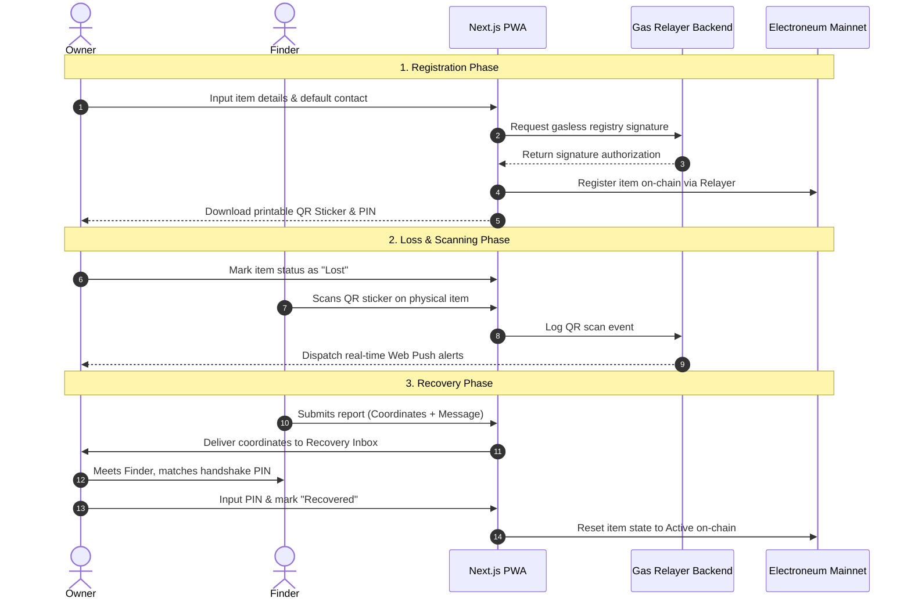

# Recover — Decentralized Physical Item Recovery Protocol

Recover is an AI-powered, privacy-first, secure physical item tracking and recovery protocol. By linking printed QR code stickers to an immutable decentralized ownership registry and leveraging AI helper utilities, it allows finders to contact owners instantly and coordinate returns securely—all without exposing the owner's private credentials or wallet address.

---

## 🔍 How Recover Works (The Core Flow)

```mermaid
sequenceDiagram
    autonumber
    actor Owner
    actor Finder
    participant App as Next.js PWA
    participant Relayer as Gas Relayer Backend
    participant Chain as Electroneum Mainnet

    Note over Owner, Chain: 1. Registration Phase
    Owner->>App: Input item details & default contact
    App->>Relayer: Request gasless registry signature
    Relayer-->>App: Return signature authorization
    App->>Chain: Register item on-chain via Relayer
    App-->>Owner: Download printable QR Sticker & PIN

    Note over Owner, Chain: 2. Loss & Scanning Phase
    Owner->>App: Mark item status as "Lost"
    Finder->>App: Scans QR sticker on physical item
    App->>Relayer: Log QR scan event
    Relayer-->>Owner: Dispatch real-time Web Push alerts

    Note over Owner, Chain: 3. Recovery Phase
    Finder->>App: Submits report (Coordinates + Message)
    App->>Owner: Deliver coordinates to Recovery Inbox
    Owner->>Finder: Meets Finder, matches handshake PIN
    Owner->>App: Input PIN & mark "Recovered"
    App->>Chain: Reset item state to Active on-chain
```

### 1. Simple Tag & Package Registration
* **Individuals**: Sign in securely via social or email credentials (no crypto keys or gas fees needed) to register personal valuables (e.g. Phone, Keys, Bag, Laptop). Category validation enforces a trusted alternate contact for Phone items.
* **Logistics Merchants**: Register commercial dispatches and packages (`/shipments`) with weight, reference name, and dual-layer tamper-proof QR stickers.

### 2. Real-Time Tracking & Scan Notifications
* **Lost Valuables (`/verify/[id]`)**: Scanning a lost item sticker opens a mobile verification page where finders submit location coordinates and notes without creating an account.
* **Commercial Shipments (`/scan/[id]`)**: Scanning a package sticker displays real-time dispatch status (`InTransit`, `Delivered`, `Disputed`), carrier details, and interactive handover PIN verification.
* **Web Push Protocol**: Scans trigger instant, real-time Web Push alerts to owners and merchant operations dashboards.

### 3. Secure Handover & Dual Monetization
* **Personal Recovery Handover**: The owner inputs a private verification PIN to match the finder's handshake, resetting the state to `Recovered`. Monetized via Pay-As-You-Go report unlocks (5,000 NGN for phones, 2,000 NGN for other items).
* **Enterprise Logistics SaaS**: Merchants access 3 Pro Tiers (Pro Starter ₦15k/mo, Pro Growth ₦45k/mo, Pro Scale ₦100k/mo) with 10% annual billing discounts and automatic quota rollover. Includes developer REST APIs (`/api/v1/shipments/*`) and webhooks for external logistics software integration.

---

## 📁 Repository Structure

* **`frontend/`**: Web application (Next.js + TS + thirdweb SDK v5 + Tailwind CSS v4)
* **`smart-contract/`**: Foundry workspace for contract development and deployment

---

## 🛠 Tech Stack & Architecture

### Frontend (Next.js PWA)
* Built using **Next.js** and styled with **Tailwind CSS**.
* **Progressive Web App (PWA)** compliance with an active service worker (`sw.js`) to support standalone home-screen installation on iOS and Android.
* **TanStack Query** handles real-time UI status polling and alerts synchronization.
* Direct RPC reads on the client-side are prohibited; all frontend pages query local database APIs.

### Backend (Next.js API Routes & MongoDB/Mongoose)
* Database layer: **MongoDB** (hosted via Atlas or locally) managed with **Mongoose ODM**.
* **AI Engine**: Connects to the **Google Gemini 2.0 Flash** API with exponential backoff retry resilience, drafting registration guidelines and coordinate context summaries.
* **Web Push Protocol**: Signs and broadcasts native mobile push alerts to clients.

### Smart Contract Layer (Electroneum Mainnet)
* Developed using **Foundry** (`forge`, `cast`) and deployed directly to Electroneum Mainnet.
* **Universal Upgradeable Proxy Standard (UUPS)**: Inherits from OpenZeppelin's UUPS Upgradeable contracts to allow future feature expansions.
* **Gasless Relayer Pattern**: Uses a cryptographic signer witness on the backend. When users register or transition item statuses, the relayer submits write transactions to the blockchain on their behalf, sponsoring gas fees to provide a seamless Web2-like user experience.

#### Deployed Contracts:
- **Electroneum Mainnet (`52014`)**:
  - **Proxy Address:** `0x67648938d99bd1809987F18a09f427D8da6C88fd`
  - **Implementation v2 (Item Deletion):** `0x86eeD26665114ECCdD2DbbCE880f968D3A908fb2` (Verified)
- **Electroneum Testnet (`5201420`)**:
  - **Proxy Address:** `0xb7D165292dA19BE617d7E0C6b983CFA2b3716BFE`
  - **Implementation v2 (Item Deletion):** `0x0a637c959cAc325b8a422d4E17EE0f1b7F57Af3b`

---

## 🚀 Workspace Commands

Run these commands from the root directory:

* **`npm run dev`**: Start the frontend development server
* **`npm run build`**: Build the frontend for production
* **`npm run start`**: Start the production server for the frontend
* **`npm run compile`**: Compile smart contracts (Forge build)
* **`npm run test`**: Run smart contract tests (Forge test)

### Database Setup
Ensure you configure the `MONGODB_URI` environment variable in your `frontend/.env.local` file pointing to a MongoDB instance. Indexes are dynamically registered via Mongoose on connection.
