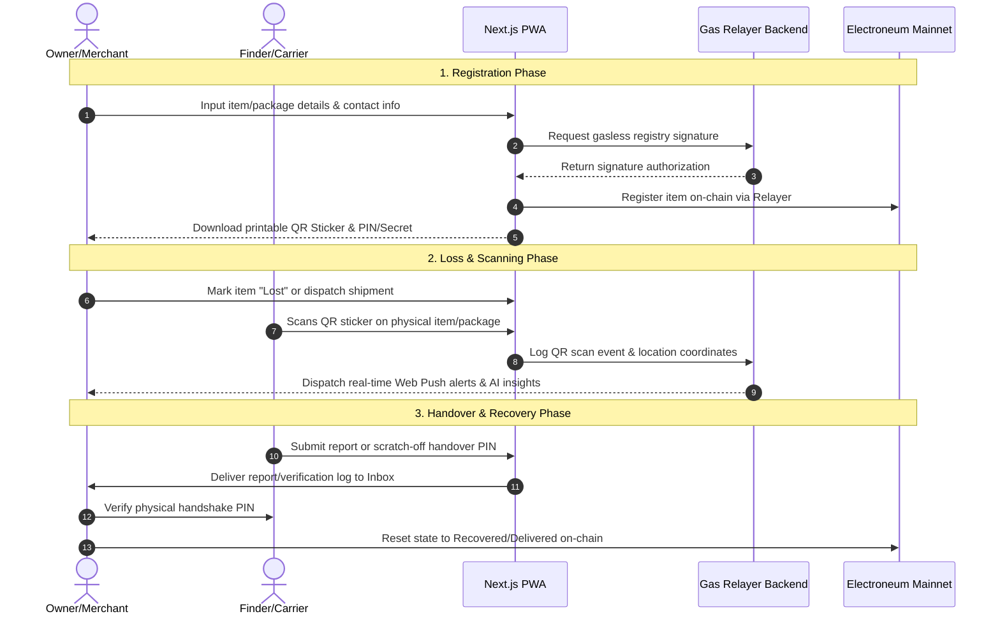

# Recover — Decentralized Physical Item & Logistics Tracking Protocol

**Recover** is a privacy-first, secure physical item tracking and logistics protocol built on the **Electroneum Mainnet** with AI-assisted messaging workflows. By pairing physical QR code stickers with an immutable decentralized registry and smart helper utilities, Recover serves two core use cases:

1. **Personal Lost & Found Recovery**: Enables owners to protect everyday valuables (Phones, Keys, Laptops, Bags, Wallets) and allows finders to report found items instantly without exposing the owner's private credentials or wallet address.
2. **Enterprise Logistics Package Tracking**: Empowers commercial merchants and shippers to dispatch tamper-proof packages (`PKG-XXXXXX`) backed by dual-layer scratch-off verification (`RCVR-XXXX`), real-time chain-of-custody event logging, and developer REST APIs.

---

## 🔍 Core User Flows & Architecture


```mermaid
sequenceDiagram
    autonumber
    actor Owner/Merchant
    actor Finder/Carrier
    participant App as Next.js PWA
    participant Relayer as Gas Relayer Backend
    participant Chain as Electroneum Mainnet

    Note over Owner/Merchant, Chain: 1. Registration Phase
    Owner/Merchant->>App: Input item/package details & contact info
    App->>Relayer: Request gasless registry signature
    Relayer-->>App: Return signature authorization
    App->>Chain: Register item on-chain via Relayer
    App-->>Owner/Merchant: Download printable QR Sticker & PIN/Secret

    Note over Owner/Merchant, Chain: 2. Loss & Scanning Phase
    Owner/Merchant->>App: Mark item "Lost" or dispatch shipment
    Finder/Carrier->>App: Scans QR sticker on physical item/package
    App->>Relayer: Log QR scan event & location coordinates
    Relayer-->>Owner/Merchant: Dispatch real-time Web Push alerts & AI insights

    Note over Owner/Merchant, Chain: 3. Handover & Recovery Phase
    Finder/Carrier->>App: Submit report or scratch-off handover PIN
    App->>Owner/Merchant: Deliver report/verification log to Inbox
    Owner/Merchant->>Finder/Carrier: Verify physical handshake PIN
    Owner/Merchant->>Chain: Reset state to Recovered/Delivered on-chain
```

---

## 🚀 Application Pages & Feature Matrix

| Page Route | Purpose & Key Features |
| :--- | :--- |
| **`/`** | **Landing Page**: Product overview, dual-value proposition, live feature showcases, and getting started CTAs. |
| **`/register`** | **Item Registration**: Register personal items with category validation (Phone, Electronics, Keys, Wallets, Bags, Vehicles, Pets, Other). Enforces trusted alternate contacts for Phones and leverages Google Gemini 2.0 to draft item descriptions. |
| **`/dashboard`** | **Owner Dashboard**: Central hub displaying registered items, loss status toggles, active QR limits, subscription status, and Sticker Studio quick links. |
| **`/items/[id]`** | **Item Details & Finder Inbox**: Manage individual item details, update status (`Active` ↔ `Lost` ↔ `Recovered`), verify handover PINs, and access Finder Reports with Stripe report detail unlocks ($3.50 USD for Phone, $1.50 USD for Other). |
| **`/verify/[id]`** | **Finder Verification Page**: No-auth mobile interface opened when a lost item sticker is scanned. Displays owner display name, item category, physical reward disclaimer, and location/courier report submission form. |
| **`/shipments`** | **Logistics Merchant Dashboard**: Commercial dispatch portal for creating tamper-proof package shipments (`PKG-XXXXXX`), scratch-off inner secret generation (`RCVR-XXXX`), subscription plan paywall cards, and dispatch logs. |
| **`/shipments/[id]`** | **Chain-of-Custody Tracker**: Public & carrier tracking page displaying real-time shipment events (`Created`, `InTransit`, `Delivered`, `Verified`, `Disputed`), carrier operator notes, Google Maps location tracking, and interactive PIN verification. |
| **`/scan/[id]`** | **Carrier Handover Scan Entrypoint**: Quick scan interface for logistics operators to verify physical scratch-off codes and record custody transitions. |
| **`/developers`** | **Logistics Developer Portal**: Comprehensive REST API documentation (`/api/v1/shipments/*`), request/response schemas, API key authorization headers (`x-api-key`), and webhook payload formats. |
| **`/settings`** | **Account & Merchant Settings**: Profile management, API key generation & rolling, and Logistics Subscription Upgrade Modal with live FX currency conversion and downgrade protection. |
| **`/pricing`** | **SaaS Pricing & Plan Comparison**: Interactive pricing page showcasing Logistics Pro Tiers (Pro Starter, Pro Growth, Pro Scale) and personal item report unlock fees. |
| **`/about`** | **About & Protocol FAQ**: Explains protocol mission, Electroneum gasless blockchain architecture, privacy standards, and common user questions. |
| **`/notifications`** | **Notifications Inbox**: Real-time log of Web Push notifications, scan alerts, and finder report submissions. |

---

## 💳 Stripe Integration & Multi-Currency Engine

Recover features a seamless payment engine powered by **Stripe Checkout & Stripe Adaptive Pricing**:

* **Personal Item Report Detail Unlocks**:
  - **Phone Category**: **$3.50 USD** base price
  - **Other Categories**: **$1.50 USD** base price
* **Enterprise Logistics SaaS Subscriptions**:
  - **Pro Starter**: **$15 / month** (or **$162 / year** — Save 10%) · Up to 10,000 dispatches/mo
  - **Pro Growth**: **$45 / month** (or **$486 / year** — Save 10%) · Up to 100,000 dispatches/mo
  - **Pro Scale**: **$100 / month** (or **$1,080 / year** — Save 10%) · Up to 500,000 dispatches/mo
* **Dynamic FX Currency Converter (`lib/currency.ts`)**:
  - Automatically detects the user's country and local currency via IP geolocation and browser locale.
  - Converts base USD prices dynamically into local currency displays (e.g., `₦5,000 NGN ($3.50 USD)`, `€3.20 EUR`, `£2.75 GBP`).
* **Subscription Rules & Quota Protection**:
  - **10% Discount** on all annual billing cycles with explicit mode labeling (`Annual Billing` vs `Monthly Billing`).
  - **Unused Quota Rollover**: Remaining unused shipment quota automatically rolls over to the next month upon renewal.
  - **Uninterrupted Metered Overage**: When a paid plan quota is exhausted, service is **never cut off**; additional shipments transition to low-cost overage billing ($0.02, $0.015, or $0.01 USD per package).
  - **Accidental Downgrade Protection**: Selecting lower tiers than the user's active plan is strictly disabled to protect existing paid capacity.

---

## 🖨️ QR Sticker Studio

Recover includes an integrated **Printable QR Sticker Studio**:

* **Standardized Sizes**:
  - **Mini (~10mm x 10mm)** — *(Recommended, equivalent to medical drug carton code)*
  - **Standard (~25mm x 25mm)**
  - **Large (~50mm x 50mm)**
* **Top-Aligned Sticker Caption**:
  All generated QR stickers include the clear caption printed above the code:
  > *"This item might be lost. If found, please scan to contact the owner."*
* **Batch Printing**: Logistics merchants can export bulk high-resolution vector PDF/PNG sticker sheets for commercial packaging.

---

## 🔒 Security, Privacy & Web3 Infrastructure

* **Electroneum Mainnet Deployed Contracts (`52014`)**:
  - **Recover Item Registry Contract (`Recover.sol`)**:
    - **Proxy Address:** `0x67648938d99bd1809987F18a09f427D8da6C88fd`
    - **Implementation v2 (Item Deletion):** `0x86eeD26665114ECCdD2DbbCE880f968D3A908fb2`
  - **Recover Shipment Logistics Contract (`RecoverShipment.sol`)**:
    - **Proxy Address:** `0xce4bF97e85212d9121e52c3F6fb2C8021Bf30012`
    - **Implementation:** `0x80fD76Cb87077144d45ed077EBB12B94161A6d59`
* **Gasless Backend Relayer Pattern**:
  - Uses an authorized backend signer witness (`ECDSAUpgradeable`) to execute write transactions on-chain.
  - Sponsoring gas fees provides a 100% Web2-like user experience without requiring users to hold native tokens (ETN) or handle crypto transactions.
* **Consumer-Friendly Copy & Privacy Default**:
  - Raw EVM hashes (`0x...`) are formatted into consumer tracking codes (`PKG-8F912A`).
  - User wallet addresses are hidden behind Display Names and Company Names.
  - Private key exports require explicit client-side "Click to Reveal" actions and are never cached or logged.
  - Alternate contact details for phones are stored securely off-chain and only revealed to verified finders.
* **AI Location Insights (Google Gemini 2.0 Flash)**:
  - Generates real-time contextual location summaries when finders submit coordinates.

---

## 📁 Repository Structure

```
recover/
├── frontend/                  # Next.js 16 PWA Frontend & Node.js API Routes
│   ├── app/                   # App Router pages and API endpoints
│   ├── components/            # UI components (Header, Modals, Inbox, etc.)
│   ├── context/               # Auth & Profile context providers
│   ├── lib/                   # Database (MongoDB), Stripe, Currency FX, Thirdweb SDK
│   └── public/                # Static assets, PWA manifest, service worker (sw.js)
├── smart-contract/            # Foundry Solidity Workspace
│   ├── src/                   # RecoverRegistry & RecoverShipment UUPS Contracts
│   ├── test/                  # Comprehensive Foundry test suites
│   └── script/                # Deployment and upgrade scripts
├── README.md                  # Project Documentation
└── AGENTS.md                  # Repository Engineering Guidelines
```

---

## 🛠 Workspace Commands

Run these commands from the root directory:

* **`npm run dev`**: Start the Next.js development server
* **`npm run build`**: Lint and compile the production Next.js build
* **`npm run lint`**: Run ESLint analysis
* **`npm run compile`**: Compile smart contracts (`forge build`)
* **`npm run test`**: Run smart contract test suite (`forge test`)

### Database Setup
Configure `MONGODB_URI` in `frontend/.env.local` pointing to your MongoDB instance. Mongoose automatically initializes collection indexes on connection.
