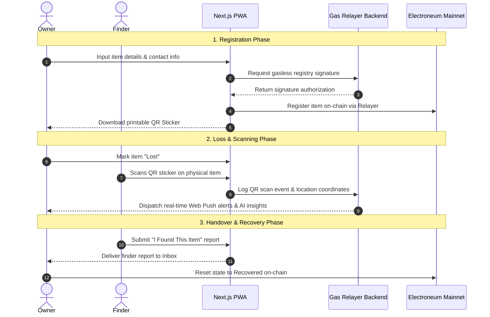
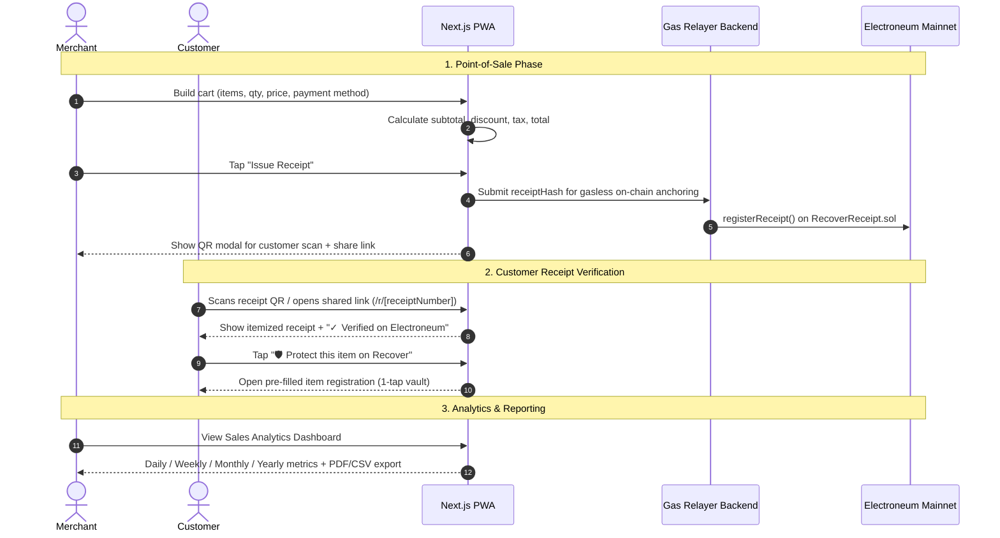

# Recover — QR-as-a-Service: Physical Item Protection, Logistics Tracking & Digital Receipts

**Recover** is a privacy-first, QR-code-powered trust and commerce protocol built on the **Electroneum Mainnet** with AI-assisted workflows. By anchoring physical QR stickers to an immutable on-chain registry and rich off-chain metadata, Recover delivers three interconnected value pillars — all without requiring users to hold or spend cryptocurrency:

1. **Proof of Purchase (Recover Digital Receipts):** Fast in-store and e-commerce digital receipt generation for SME merchants, verifiable on-chain sales records, automated sales analytics, and a 1-tap consumer bridge that converts purchased items directly into protected Recover vault items. Features full multi-user team collaboration (Owner, Manager, Sales Rep roles), multi-branch operations, and permanent immutable audit trails for every transaction.
2. **Proof of Custody & Dispatch (Recover Shipments):** Tamper-proof commercial package tracking, dual-layer QR stickers, and scratch-off PIN handovers for logistics and delivery operators.
3. **Proof of Ownership & Recovery (Recover Items):** Decentralized lost-and-found protection connecting finders directly to item owners via scannable QR stickers — without revealing personal data.

> **Launch Markets:** Recover is launching simultaneously in **Nigeria** and the **United States**, with dual incorporation across both jurisdictions. The Nigerian digital receipts pillar aligns directly with the NRS (Nigeria Revenue Service) phased e-invoicing mandate rolling out to SMEs through July 2027, making Recover a timely compliance-adjacent tool for Nigerian small businesses.

---

## 🔍 Core User Flows & Architecture

### Flow 1 — Item Registration, Loss & Recovery


```mermaid
sequenceDiagram
    autonumber
    actor Owner
    actor Finder
    participant App as Next.js PWA
    participant Relayer as Gas Relayer Backend
    participant Chain as Electroneum Mainnet

    Note over Owner, Chain: 1. Registration Phase
    Owner->>App: Input item details & contact info
    App->>Relayer: Request gasless registry signature
    Relayer-->>App: Return signature authorization
    App->>Chain: Register item on-chain via Relayer
    App-->>Owner: Download printable QR Sticker

    Note over Owner, Chain: 2. Loss & Scanning Phase
    Owner->>App: Mark item "Lost"
    Finder->>App: Scans QR sticker on physical item
    App->>Relayer: Log QR scan event & location coordinates
    Relayer-->>Owner: Dispatch real-time Web Push alerts & AI insights

    Note over Owner, Chain: 3. Handover & Recovery Phase
    Finder->>App: Submit "I Found This Item" report
    App-->>Owner: Deliver finder report to Inbox
    Owner->>Chain: Reset state to Recovered on-chain
```

### Flow 2 — Digital Receipt Issuance & Consumer Verification


```mermaid
sequenceDiagram
    autonumber
    actor Merchant
    actor Customer
    participant App as Next.js PWA
    participant Relayer as Gas Relayer Backend
    participant Chain as Electroneum Mainnet

    Note over Merchant, Chain: 1. Point-of-Sale Phase
    Merchant->>App: Build cart (items, qty, price, payment method)
    App->>App: Calculate subtotal, discount, tax, total
    Merchant->>App: Tap "Issue Receipt"
    App->>Relayer: Submit receiptHash for gasless on-chain anchoring
    Relayer->>Chain: registerReceipt() on RecoverReceipt.sol
    App-->>Merchant: Show QR modal for customer scan + share link

    Note over Customer, Chain: 2. Customer Receipt Verification
    Customer->>App: Scans receipt QR / opens shared link (/r/[receiptNumber])
    App-->>Customer: Show itemized receipt + "✓ Verified on Electroneum"
    Customer->>App: Tap "🛡️ Protect this item on Recover"
    App-->>Customer: Open pre-filled item registration (1-tap vault)

    Note over Merchant, Chain: 3. Analytics & Reporting
    Merchant->>App: View Sales Analytics Dashboard
    App-->>Merchant: Daily / Weekly / Monthly / Yearly metrics + PDF/CSV export
```

---

## 🚀 Application Pages & Feature Matrix

| Page Route | Purpose & Key Features |
| :--- | :--- |
| **`/`** | **Landing Page**: Product overview, three-pillar value proposition, live feature showcases, and getting started CTAs. |
| **`/register`** | **Item Registration**: Register personal items with category validation (Phone, Electronics, Keys, Wallets, Bags, Vehicles, Pets, Other). Enforces trusted alternate contacts for Phones and leverages Google Gemini 2.0 to draft recovery instructions. |
| **`/dashboard`** | **Owner Dashboard**: Central hub displaying registered items, loss status toggles, active QR limits, subscription status, and Sticker Studio quick links. |
| **`/items/[id]`** | **Item Details & Finder Inbox**: Manage individual item details, update status (`Active` ↔ `Lost` ↔ `Recovered`), verify handover PINs, and access Finder Reports with Stripe report detail unlocks ($3.50 USD for Phone, $1.50 USD for Other). |
| **`/verify/[id]`** | **Finder Verification Page**: No-auth mobile interface opened when a lost item sticker is scanned. Displays owner display name, item category, physical reward disclaimer, and location/finder report submission form. |
| **`/workspace`** | **Merchant POS Terminal & Sales Analytics**: Central merchant workspace combining the POS receipt terminal, real-time analytics cards (daily/weekly/monthly/yearly), and receipt ledger in a single unified dashboard. |
| **`/workspace/login`** | **Staff & Cashier Login Portal**: Fast passwordless email + 6-digit numeric PIN authentication for store managers and sales staff. |
| **`/receipts`** | **Receipt Ledger**: Full searchable and filterable receipt management table with voiding, audit trail, and status filtering. |
| **`/receipts/new`** | **POS Receipt Entry**: Rapid multi-item cart entry with product autocomplete quick-pick, quantity steppers, discount/tax fields, payment method selector, and dual fulfillment (in-person handover or Shipment dispatch). |
| **`/r/[receiptNumber]`** | **Public Customer Receipt Page**: No-auth, zero-barrier receipt verification page showing merchant branding, itemized purchase, on-chain cryptographic proof, PDF download, and the "🛡️ Protect on Recover" 1-tap consumer bridge CTA. |
| **`/shipments`** | **Logistics Merchant Dashboard**: Commercial dispatch portal for creating tamper-proof package shipments (`RCV-` + 12 hex chars), scratch-off inner secret generation (`RCVR-` + 8 hex chars), chain-of-custody tracking, and dispatch logs. |
| **`/shipments/[id]`** | **Chain-of-Custody Tracker**: Private tracking page displaying real-time shipment events (`Created`, `InTransit`, `Delivered`, `Verified`, `Disputed`), dispatch rider PINs, Google Maps location tracking, and custody handover tools. |
| **`/scan/[id]`** | **Dual Public & Rider Scan View**: No-auth interface serving two roles — (1) **Rider Link (`?pin=XXXX`)**: Unlocks Rider Delivery Manifest; (2) **Recipient Link**: Public tracking + account-free scratch-off PIN verification. |
| **`/developers`** | **Logistics Developer Portal**: REST API documentation (`/api/v1/shipments/*`), request/response schemas, API key authorization, and webhook payload formats. |
| **`/settings`** | **Account, Merchant, Teams & Branches**: Profile management, business logo upload, API key generation & rolling, private key export (client-side only), Subscription Upgrade Modal, and full Merchant Team Management (invite/remove staff, manage store branches, and assign branch managers). |
| **`/pricing`** | **SaaS Pricing & Plan Comparison**: Interactive pricing page showcasing Merchant Pro Tiers (Free Bootstrap, Pro Starter, Pro Growth, Pro Scale) and personal item report unlock fees. |
| **`/about`** | **About & Protocol FAQ**: Explains protocol mission, Electroneum gasless architecture, privacy standards, and common user questions. |
| **`/notifications`** | **Notifications Inbox**: Real-time log of Web Push notifications, scan alerts, and finder report submissions. |

---

## 💳 Stripe Integration & Multi-Currency Engine

Recover features a seamless payment engine powered by **Stripe Checkout & Stripe Adaptive Pricing**:

- **Personal Item Report Detail Unlocks**:
  - **Phone Category**: **$3.50 USD** base price
  - **Other Categories**: **$1.50 USD** base price
- **Merchant & Commercial SaaS Subscriptions** (Receipts + Shipments unified quota):

| Tier | Monthly Operations Quota (Receipts + Shipments) | Monthly Price | Annual Price (10% Discount) | Effective Monthly | Metered Overage Rate |
|---|---|---|---|---|---|
| **Free Bootstrap Tier** | 100 / mo | $0 | $0 | $0 | Blocked at 100 |
| **Pro Starter Tier** | 10,000 / mo | $15 / mo | $162 / yr | $13.50 / mo | $0.02 / op |
| **Pro Growth Tier** | 100,000 / mo | $45 / mo | $486 / yr | $40.50 / mo | $0.015 / op |
| **Pro Scale Tier** | 500,000 / mo | $100 / mo | $1,080 / yr | $90.00 / mo | $0.01 / op |
| **Enterprise Custom Tier** | Custom / Unlimited | Custom | Custom | Custom SLA | Custom Volume Rates |

- **Unified Operation Unit**: 1 quota unit = 1 Digital Receipt issued OR 1 Shipment Package dispatched.
- **Dynamic FX Currency Converter (`lib/currency.ts`)**:
  - Automatically detects the user's country and local currency via IP geolocation and browser locale.
  - Converts base USD prices dynamically (e.g., `₦5,000 NGN ($3.50 USD)`, `€3.20 EUR`, `£2.75 GBP`).
- **Subscription Rules & Quota Protection**:
  - **10% Discount** on all annual billing cycles.
  - **Unused Quota Rollover**: Remaining unused operations automatically roll over upon renewal.
  - **Uninterrupted Metered Overage**: When a paid plan quota is exhausted, service is **never cut off**; additional operations transition to low-cost overage billing.
  - **Accidental Downgrade Protection**: Selecting lower tiers than the user's active plan is strictly disabled.

---

## 🖨️ QR Sticker Studio

Recover includes an integrated **Printable QR Sticker Studio** with context-aware captions per use case:

- **Item Protection Stickers** (Lost & Found):
  - Caption: _"This item might be lost. If found, please scan to contact the owner."_
- **Receipt QR Codes** (Digital Receipts):
  - The QR encodes the public receipt verification URL (`/r/[receiptNumber]`) — no caption required on the code itself; merchant branding appears on the receipt slip.

- **Standardized Sizes**:
  - **Mini (~10mm x 10mm)** — _(Recommended, equivalent to medical drug carton code)_
  - **Standard (~25mm x 25mm)**
  - **Large (~50mm x 50mm)**
- **Batch Printing**: Logistics merchants can export bulk high-resolution vector PDF/PNG sticker sheets for commercial packaging.

---

## 🔒 Security, Privacy & Web3 Infrastructure

- **Electroneum Mainnet Deployed Contracts (Chain ID `52014`)**:
  - **Recover Item Registry Contract (`Recover.sol`)**:
    - **Proxy Address:** `0x67648938d99bd1809987F18a09f427D8da6C88fd`
    - **Implementation v2 (Current):** `0x86eeD26665114ECCdD2DbbCE880f968D3A908fb2`
  - **Recover Shipment Logistics Contract (`RecoverShipment.sol`)**:
    - **Proxy Address:** `0xce4bF97e85212d9121e52c3F6fb2C8021Bf30012`
    - **Implementation v2 (Current):** `0xC5c262ddF9e730ABD6eF57d45316777c919Ff5A4`
  - **Recover Digital Receipt Contract (`RecoverReceipt.sol`)**:
    - **Proxy Address:** `0xe7Fd5C712BA26cd3a25faaDE4Be258585D0879c2`
    - **Implementation (Current, Verified):** `0xB4A1901C719c8100F15168B580828e9a15e6E5ef`
- **Gasless Backend Relayer Pattern**:
  - Uses an authorized backend signer witness (`ECDSAUpgradeable`) to execute write transactions on-chain.
  - Sponsoring gas fees provides a 100% Web2-like user experience without requiring users to hold native tokens (ETN) or handle crypto transactions.
- **Cryptographic Signed Wallet Challenge Session Auth (`/api/auth/token`)**:
  - Enforces cryptographic signature proof before issuing HTTP-only session JWT tokens.
- **Consumer-Friendly Copy & Privacy Default**:
  - Raw EVM hashes (`0x...`) are formatted into consumer tracking codes (`PKG-8F912A`, `RCVR-REC-XXXX`).
  - User wallet addresses are hidden behind Display Names and Company Names.
  - Private key exports require explicit client-side "Click to Reveal" actions and are never cached or logged.
  - Alternate contact details for phones are stored securely off-chain and only revealed to verified finders.
  - **Receipt PII**: Customer names, transaction amounts, and item details are never stored on-chain — only a cryptographic `receiptHash` of the canonical JSON payload is anchored on Electroneum.
- **Nigeria NRS Compliance Alignment**:
  - Nigeria's e-invoicing mandate (NRS, phased rollout to all VAT-registered SMEs by July 2027) requires QR-coded digital invoices. Recover Digital Receipts is architecturally aligned with this mandate — providing cryptographically verified, QR-scannable receipts as a core feature.
- **AI Location Insights (Google Gemini 2.0 Flash)**:
  - Generates real-time contextual location summaries when finders submit coordinates.

---

## 📁 Repository Structure

```
recover/
├── frontend/                  # Next.js 16 PWA Frontend & Node.js API Routes
│   ├── app/                   # App Router pages and API endpoints
│   │   ├── receipts/          # Merchant POS terminal, receipt ledger, new receipt entry
│   │   ├── r/[receiptNumber]/ # Public customer receipt verification page
│   │   ├── shipments/         # Logistics dispatch and chain-of-custody tracking
│   │   ├── workspace/         # Unified merchant analytics & POS workspace
│   │   └── api/v1/            # REST API routes (receipts, shipments, items, auth)
│   ├── components/            # UI components (Header, Modals, Receipts, Shipments, etc.)
│   ├── context/               # Auth & Profile context providers
│   ├── lib/                   # MongoDB, Stripe, Currency FX, pdf-generator, Thirdweb SDK
│   └── public/                # Static assets, PWA manifest, service worker (sw.js)
├── smart-contract/            # Foundry Solidity Workspace
│   ├── src/
│   │   ├── Recover.sol            # Item Registry — UUPS Upgradeable
│   │   ├── RecoverShipment.sol    # Logistics & Chain-of-Custody — UUPS Upgradeable
│   │   └── RecoverReceipt.sol     # Digital Receipt Anchoring — UUPS Upgradeable
│   ├── test/                  # Comprehensive Foundry test suites
│   └── script/                # Deployment and upgrade scripts
├── README.md                  # Project Documentation
├── PRD.md                     # Product Requirements Document
├── BUILD_GUIDE.md             # Engineering Build Guide
├── BRANDING.md                # Design & Brand System
└── AGENTS.md                  # Repository Engineering Guidelines
```

---

## 🛠 Workspace Commands

Run these commands from the root directory:

- **`npm run dev`**: Start the Next.js development server
- **`npm run build`**: Lint and compile the production Next.js build
- **`npm run lint`**: Run ESLint analysis
- **`npm run compile`**: Compile smart contracts (`forge build`)
- **`npm run test`**: Run smart contract test suite (`forge test`)

### Database Setup

Configure `MONGODB_URI` in `frontend/.env.local` pointing to your MongoDB instance. Mongoose automatically initializes collection indexes on connection.
