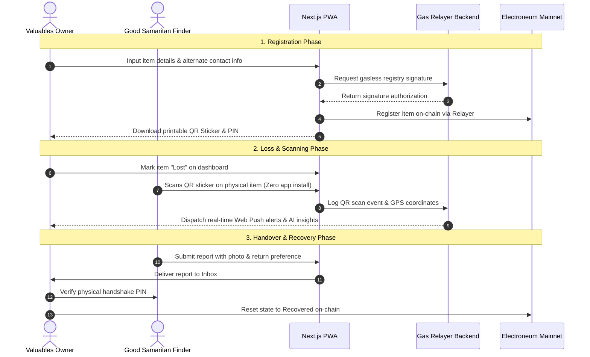

# Recover — Decentralized Physical Item Tracking & Recovery Protocol

**Recover** is a privacy-first, secure physical item tracking and recovery protocol built on the **Electroneum Mainnet** with AI-assisted messaging workflows. By pairing physical QR code stickers with an immutable decentralized registry and smart helper utilities, Recover enables owners to protect everyday valuables (Phones, Keys, Laptops, Bags, Wallets, Pets) and allows finders to report found items instantly without exposing the owner's private credentials or wallet address.

---

## 🔍 Core User Flows & Architecture


```mermaid
sequenceDiagram
    autonumber
    actor Owner as Valuables Owner
    actor Finder as Good Samaritan Finder
    participant App as Next.js PWA
    participant Relayer as Gas Relayer Backend
    participant Chain as Electroneum Mainnet

    Note over Owner, Chain: 1. Registration Phase
    Owner->>App: Input item details & alternate contact info
    App->>Relayer: Request gasless registry signature
    Relayer-->>App: Return signature authorization
    App->>Chain: Register item on-chain via Relayer
    App-->>Owner: Download printable QR Sticker & PIN

    Note over Owner, Chain: 2. Loss & Scanning Phase
    Owner->>App: Mark item "Lost" on dashboard
    Finder->>App: Scans QR sticker on physical item (Zero app install)
    App->>Relayer: Log QR scan event & GPS coordinates
    Relayer-->>Owner: Dispatch real-time Web Push alerts & AI insights

    Note over Owner, Chain: 3. Handover & Recovery Phase
    Finder->>App: Submit report with photo & return preference
    App->>Owner: Deliver report to Inbox
    Owner->>Finder: Verify physical handshake PIN
    Owner->>Chain: Reset state to Recovered on-chain
```

---

## 🚀 Application Pages & Feature Matrix

| Page Route | Purpose & Key Features |
| :--- | :--- |
| **`/`** | **Landing Page**: Product overview, core value proposition, live feature showcases, and getting started CTAs. |
| **`/register`** | **Item Registration**: Register personal items with category validation (Phone, Electronics, Keys, Wallets, Bags, Vehicles, Pets, Other). Enforces trusted alternate contacts for Phones and leverages Google Gemini 2.0 to draft item descriptions. |
| **`/dashboard`** | **Owner Dashboard**: Central hub displaying registered items, loss status toggles (`Active` ↔ `Lost` ↔ `Recovered`), and Sticker Studio quick links. |
| **`/items/[id]`** | **Item Details & Finder Inbox**: Manage individual item details, update status, verify handover PINs, and access Finder Reports with Stripe report detail unlocks ($3.50 USD for Phone, $1.50 USD for Other). |
| **`/verify/[id]`** | **Finder Verification Page**: No-auth mobile interface opened when a lost item sticker is scanned. Displays owner display name, item category, reward notes, GPS auto-capture, and return submission form. |
| **`/settings`** | **Account & Privacy Settings**: Personal profile management, protected contact channels, and Electroneum wallet identity. |
| **`/pricing`** | **Transparent Pricing**: 100% free registration & sticker printing with one-time pay-per-recovery finder report unlock fees ($1.50 / $3.50) and dynamic local currency FX conversion. |
| **`/about`** | **About & Protocol FAQ**: Explains protocol mission, Electroneum gasless blockchain architecture, privacy standards, and common user questions. |
| **`/notifications`** | **Notifications Inbox**: Real-time log of Web Push notifications, scan alerts, and finder report submissions. |

---

## 💳 Stripe Integration & Multi-Currency Engine

Recover features a seamless payment engine powered by **Stripe Checkout & Stripe Adaptive Pricing**:

* **Personal Item Report Detail Unlocks**:
  - **Phone Category**: **$3.50 USD** base price
  - **Other Categories**: **$1.50 USD** base price
* **Dynamic FX Currency Converter (`lib/currency.ts`)**:
  - Automatically detects the user's country and local currency via IP geolocation and browser locale.
  - Converts base USD prices dynamically into local currency displays (e.g., `₦5,000 NGN ($3.50 USD)`, `€3.20 EUR`, `£2.75 GBP`).
* **One-Time Lost Cycle Payment**:
  - Once unlocked for a loss event, all updates and messages within that recovery cycle remain unlocked.

---

## 🖨️ QR Sticker Studio

Recover includes an integrated **Printable QR Sticker Studio**:

* **Standardized Sizes**:
  - **Mini (~10mm x 10mm)** — *(Recommended for AirPods, key fobs, chargers)*
  - **Standard (~25mm x 25mm)** — *(Smartphones, wallets, passports, tablets)*
  - **Large (~50mm x 50mm)** — *(Laptops, backpacks, bicycle frames, luggage)*
* **Top-Aligned Sticker Caption**:
  All generated QR stickers include the clear caption printed above the code:
  > *"This item might be lost. If found, please scan to contact the owner."*
* **Vector Quality**: High-DPI SVG export, print-ready PDF with alignment grids, and PNG lockscreen formats.

---

## 🔒 Security, Privacy & Web3 Infrastructure

* **Electroneum Mainnet (`52014`)**:
  - **UUPS Upgradeable Proxy Address:** `0x67648938d99bd1809987F18a09f427D8da6C88fd`
  - **Implementation v2 (Item Deletion):** `0x86eeD26665114ECCdD2DbbCE880f968D3A908fb2`
* **Gasless Backend Relayer Pattern**:
  - Uses an authorized backend signer witness (`ECDSAUpgradeable`) to execute write transactions on-chain.
  - Sponsoring gas fees provides a 100% Web2-like user experience without requiring users to hold native tokens (ETN) or handle crypto transactions.
* **Consumer-Friendly Copy & Privacy Default**:
  - User wallet addresses and phone numbers are hidden behind Display Names.
  - Alternate contact details for phones are stored securely off-chain and only revealed to verified finders.
* **AI Location Insights (Google Gemini 2.0 Flash)**:
  - Generates real-time contextual location summaries when finders submit coordinates.

---

## 📁 Repository Structure

```
recover/
├── frontend/                  # Next.js 16 PWA Frontend & Node.js API Routes
│   ├── app/                   # App Router pages and API endpoints
│   ├── components/            # UI components (Header, Modals, Inbox, etc.)
│   ├── context/               # Auth & Profile context providers
│   ├── lib/                   # Database (MongoDB), Stripe, Currency FX, Thirdweb SDK
│   └── public/                # Static assets, PWA manifest, service worker (sw.js)
├── smart-contract/            # Foundry Solidity Workspace
│   ├── src/                   # Recover.sol UUPS Contract
│   ├── test/                  # Comprehensive Foundry test suite (Recover.t.sol)
│   └── scripts/               # Deployment and upgrade scripts (Recover.s.sol)
├── PRD.md                     # Product Requirements Document
├── BRANDING.md                # Brand Identity & Design System Guidelines
└── README.md                  # Project Documentation
```

---

## 🛠 Workspace Commands

Run these commands from the root directory:

* **`npm run dev`**: Start the Next.js development server
* **`npm run build`**: Lint and compile the production Next.js build
* **`npm run lint`**: Run ESLint analysis
* **`npm run compile`**: Compile smart contracts (`forge build`)
* **`npm run test`**: Run smart contract test suite (`forge test`)
